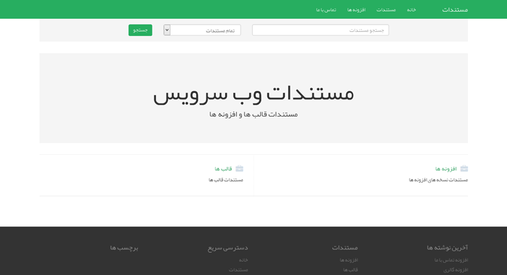

# weDocs

A clean documentation theme for WordPress

demo: [docs.wedevs.com](http://docs.wedevs.com)

## Using

* Just create categories and assign posts to the category. Thats all you need. 
* To create bootstrap like navigation in left side of each post, you've to put heading in H1 tag on your posts. H1 tags will be automatically pulled out and placed as navigation. [example](http://docs.wedevs.com/creating-posting-forms/)
* Open the theme customiser. There is a logo and home page headline, sub heading text and footer text option for customisation.

### Built with

* [Twitter Bootstrap](http://getbootstrap.com)
* [Font Awesome](http://fontawesome.io/)
* [Roots](http://roots.io)
* [Less](http://www.lesscss.org/)

## Contribute
If you want to contribute on this project, you are more than welcome.

## Author
[Tareq Hasan](http://tareq.wedevs.com)
